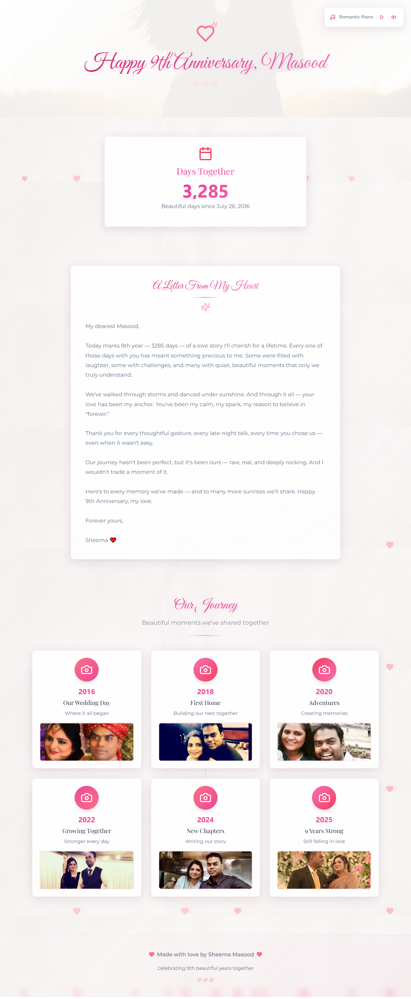

# 💕 Anniversary Wishes Website

A beautiful, romantic, and elegant anniversary website.


## ✨ Features

<table>
  <tr>
    <td>
      
    </td>
    <td>

### 🎨 **Elegant Design**
- Sophisticated background with subtle textures and elegant gradients  
- Romantic color palette (blush pink, rose, soft gold)  
- Custom typography using *Great Vibes*, *Montserrat*, and *Playfair Display*  
- Floating heart animations for magical ambiance  
- Fully responsive design for all screen sizes  

### 💌 **Romantic Content**
- **Hero Section**: "Happy 9th Anniversary, Masood" greeting  
- **Love Letter**: Heartfelt personal message from Sheema to Masood  
- **Day Counter**: Live calculation showing days together since July 26, 2016  
- **Our Journey**: Timeline with image placeholders for cherished memories  
- **Footer**: "Made with love by Sheema Masood"  

### 🎵 **Interactive Features**
- 🎶 Background music (romantic piano) with play/pause & mute/unmute  
- ✨ Smooth fade-in animations and floating hearts  
- 🖱️ Elegant hover effects and gentle transitions  

## 💝 Special Features

- **Day Counter**: Automatically calculates days since July 26, 2016
- **Elegant Animations**: Smooth fade-in, floating, and shimmer effects
- **Sophisticated Design**: Professional-grade romantic styling
- **Interactive Music**: Web Audio API generated piano melodies
- **Love Letter Integration**: Personal heartfelt message beautifully displayed
- **Photo Placeholders**: Ready for adding personal memories

## 🎊 Perfect For

- Anniversary celebrations
- Romantic gestures
- Wedding anniversaries
- Valentine's Day
- Special relationship milestones
- Love letters and messages

</td>
  </tr>
</table>

## 🔗 Live Demo

Check out the live anniversary website here:  
👉 [Visit Website](https://wishanniversary.netlify.app/)

## 🚀 Quick Start (How to run locally?) 

### Prerequisites
- Node.js (v14 or higher)
- npm or yarn package manager

### Installation

1. **Clone the repository**
   ```bash
   git clone <repository-url>
   cd anniversary-website
   ```

2. **Navigate to frontend directory**
   ```bash
   cd frontend
   ```

3. **Install dependencies**
   ```bash
   yarn install
   # or
   npm install
   ```

4. **Start the development server**
   ```bash
   yarn start
   # or
   npm start
   ```

5. **Open your browser**
   Navigate to `http://localhost:3000` to view the website

## 🌐 Deployment

### Deploy to Netlify

1. **Build the project**
   ```bash
   cd frontend
   yarn build
   ```

2. **Deploy to Netlify**
   - Option 1: Drag and drop the `build` folder to [Netlify Deploy](https://app.netlify.com/drop)
   - Option 2: Connect your GitHub repository to Netlify for automatic deployments

3. **Build Settings for Netlify**
   - Build command: `cd frontend && yarn build`
   - Publish directory: `frontend/build`
  
Want to create your own romantic website like this?  
Click the button below to instantly deploy it on **Netlify**:

[](https://app.netlify.com/start/deploy?repository=https://github.com/SheemaMasood381/webpage-for-anniversary-wishes)


### Environment Variables
No environment variables are required for the frontend deployment.

## 🎯 Technical Details

### Tech Stack
- **Frontend**: React 20, CSS3, HTML5
- **Styling**: Tailwind CSS with custom romantic themes
- **Icons**: Lucide React
- **UI Components**: Shadcn/ui components
- **Audio**: Web Audio API for romantic piano melodies
- **Fonts**: Google Fonts (Great Vibes, Montserrat, Playfair Display)

### Key Components
- `Home.jsx` - Main page with all sections
- `BackgroundMusic.jsx` - Romantic piano music player
- `FloatingHearts.jsx` - Animated floating hearts effect
- `App.css` - Custom elegant styling and animations

### Browser Compatibility
- Chrome (recommended)
- Firefox
- Safari
- Edge
- Mobile browsers

## 🎨 Customization

### Colors
The romantic color palette can be customized in `App.css`:
- Primary: Rose/Pink tones (#be185d, #ec4899, #f472b6)
- Background: Elegant gradients with subtle textures
- Text: Sophisticated grays (#64748b)

### Fonts
Three beautiful font families are used:
- **Great Vibes**: Elegant script for headings
- **Montserrat**: Clean sans-serif for body text
- **Playfair Display**: Sophisticated serif for special text

## ✏️ Quick Personalization

1. **Open** `Home.jsx` in your project.
2. **Update the following lines** with your details:

```js
const anniversaryDate = new Date("2016-07-26");
const partnerName = "Masood";
const yourName = "Sheema";
```

### 🔁 Replace with your own values

For example:

```js
const anniversaryDate = new Date("2020-02-14"); // Your anniversary date
const partnerName = "Adeel";                    // Your partner's name
const yourName = "Zara";                        // Your name
```

**Once updated:**
- The greeting
- The day counter
- And all dynamic content  
will automatically update—no extra setup needed!


## 📱 Mobile Responsive

The website is fully responsive and provides an excellent experience on:
- Desktop computers
- Tablets
- Mobile phones
- Various screen sizes and orientations

## 🎵 Audio Features

The romantic piano music uses the Web Audio API to create:
- Soft piano melodies with harmonies
- Elegant looping with sophisticated pauses
- Volume control and mute functionality
- No external audio files required

## 🛠️ Development

### File Structure
```
frontend/
├── public/
├── src/
│   ├── components/
│   │   ├── ui/          # Shadcn UI components
│   │   ├── Home.jsx     # Main page component
│   │   ├── BackgroundMusic.jsx
│   │   └── FloatingHearts.jsx
│   ├── App.js
│   ├── App.css          # Custom elegant styling
│   └── index.js
└── package.json
```

### Scripts
- `yarn start` - Start development server
- `yarn build` - Build for production
- `yarn test` - Run tests


## 📧 Support

This beautiful anniversary website was created with love and attention to detail. For any questions or customizations, the codebase is well-documented and easy to modify.

---

**"Every love story is beautiful, but ours is my favorite."** 💕

Made with ❤️ by Sheema Masood for 9 beautiful years together.

      
